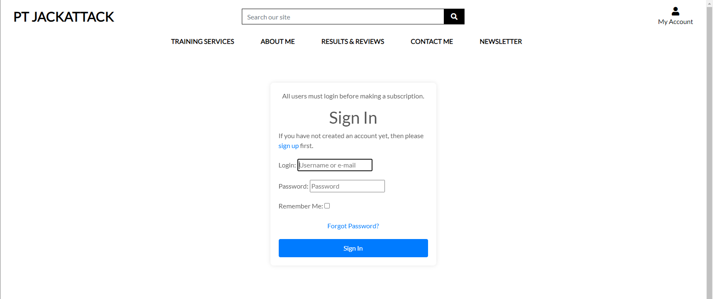
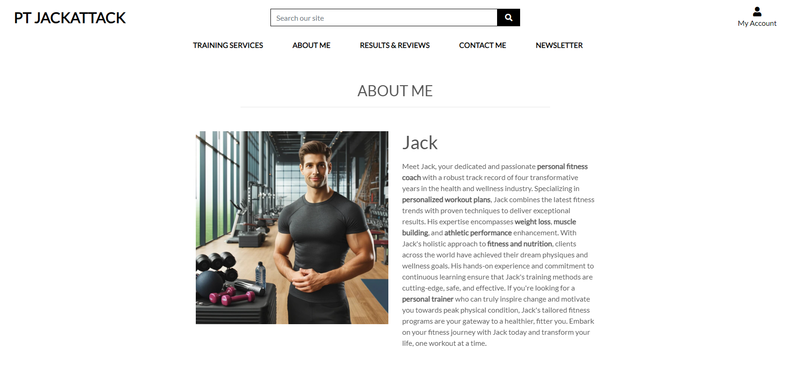

# PT JACKATTACK

## Introduction

PT JACKATTACK is a fictional B2C e-commerce store that is designed and implemented with Python and Django, HTML, CSS and some Javascript. It specialises in the fitness industry by selling subscriptions. However it has to be noted that this site is for educational use only.

---

Portfolio 5 project as part of the Diploma in Full Stack Software Development by Code Institute.

Link to deployed site can be found [Here](https://pt-pp-p-5-acaa98cb0828.herokuapp.com/)

----
### PT JACKATTACK

### Strategy

* PT JACKATTACK is a B2C type of business. It is to help people that are trying to get into the fitness industry. Some people might be looking to lose weight other's might be looking to build muscle. Our e-commerce store has it all.

---

## CONTENTS

- [Features](#features)
- [User Experience/UX](#user-experienceux)
  - [Target Audience](#target-audience)
  - [User Stories](#user-stories)
    - [New Visitor Goals](#new-visitor-goals)
    - [Existing Visitor Goals](#existing-visitor-goals)
- [Design Choices](#design-choices)
  - [Colour Scheme](#colour-scheme)
  - [Typography](#typography)
  - [Favicon](#favicon)
  - [Wireframes](#wireframes)
  - [Flow Diagram](#flow-diagram)
  - [Database Plan](#database-plan)
- [Web marketing](#Web-marketing)
    - [Email marketing](Email-marketing)
    - [seo](seo)
- [Technologies Used](#technologies-used)
    - [Programming Languages, Frameworks and Libraries Used](#programming-languages-frameworks-and-libraries-used)
    - [Agile](#agile)
- [Testing](#testing)
  - [TESTING.md](#testing)
- [Deployment](#deployment)
    - [Github Deployment](#github-deployment)
    - [Repository deployment via Heroku](#repository-deployment-via-heroku)
    - [Deployment of the app](#deployment-of-the-app)
- [Credits](#credits)

---

# User Experience/UX

## Target Audience

- Users that are interested in getting into the fitness industry.

## User Stories

### New Visitor Goals

- To understand what the site and content is about.
- How to navigate the site.
- Create an account and engage with the site and other users and site owner.

### Existing Visitor Goals

- Log in and out of their account.
- Read reveiws about other people's experiences.
- Contact the personal trainer.
- Make a subscription for themselves depending on what they want to achieve.
- Cancel their subscription.

___

# Design Choices

## Colour Scheme

The colour scheme used for this project was based on the colors from Code Institute's 'Boutique Ado' walkthrough module. I have added and modified many aspects of the styling and colours to suit my intentions. It is a fairly neutral scheme, with only the actionable aspects (buttons/links etc) displayed in brighter colours for ease of navigation or site use.

## Typography

The main font used is Lato.

## Favicon

The Favicon was AI generated.

---

## Wireframes

---

## Flow Diagram

Here is a diagram showing the possible flow through the site. 

---

## Database Plan

The database plan is fairly simple, but it shows the information that is stored within the database, the type of data and if it is logged as a Primary or Foreign key where applicable.

---

# Features

## The home page

## Registration

The user can create an account.

## Sign in

Registered users would need to sign in when they visit the site again. They will be asked to enter their username and password. The Remember me option is also available making life easier for returning users. Is users need to reset their password, a forgot password is also available.

## Logout

Users are able to protecting their account by logging out of the site.

## All products

This is where you can display all products available.

## Product details

This is where you can display product details.

## About me 

This is where you can learn about the personal trainer.

## Results and reviews

This is where you can learn about results and reviews.

## Results and reviews

This is where you can learn about results and reviews.

## Contact

This is where you can contact the PT or follow the FB page.

## Facebook

In terms of marketing, the site has a facebook page to push content.and target some of its customers through content creation

## Newsletter

Users can sign up using their email to receive news, offers and deals straight into their inbox.

## Cancel checkout 

This is where users will get redirected if they cancel the payment process.

## Add product

Super users can also add the products and update the changes.

## Edit product

Super users can also edit the products and update the changes.

## Delete product

If the product is no longer serving its purposes, super users can also delete it.

## Messages

Super users can view the messages the users have sent them.

## Messages details

This is where they can view them and delete them

## User Profile

This is where users can view thier subscriptions and cancel them.

## Review management

This is where super users can add a review.

## 404 page

A 404 page is also available to handle navigation errors with a home link button to take them back to the home page.

## Footer

The footer appears on only the home page of the site, it contains the newsletter sign up, privacy policy and facebook.

---

# Web marketing

## Email marketing

The free version of mailchimp was chosen with the current status of the business. Each user that signs up is added to the weekly newsletter and they might turn out to be future customers henceforth low cost to drive sales.

## Search engine optimization

Depending on what page you are on there are different SEO keywords.

## Social media marketing

A facebook page was created to build community from the target market. Facebook is free and it also takes little to no time to set up and also it has so many users whom a business can strive to maintain a certain relationship, create content and connect with a target audience.

# Technologies Used

Here are the technologies used to build this project:

- [Vscode](https://code.visualstudio.com/) the IDE where the site was built.

- [GitPod](https://www.gitpod.io/) the IDE when I used tutor Assistance.

- [PEP8 Validator](https://pep8ci.herokuapp.com/) Used to check python
code for errors.

- [ElephandSQL](https://www.elephantsql.com/) Used to store PostgreSQL.database.

- [Heroku](https://id.heroku.com/) Used to deploy the project.

- [AWS](https://aws.amazon.com/) Used to store static files.

- [DALL-E](https://openai.com/dall-e-2) Used for generating images.

- [Github](https://github.com/) I used Github to store all the data of my project after pushing it.

# Programming Languages, Frameworks and Libraries Used

- [HTML](https://developer.mozilla.org/en-US/docs/Web/HTML)
- [CSS](https://developer.mozilla.org/en-US/docs/Learn/Getting_started_with_the_web/CSS_basics)
- [Javascript](https://en.wikipedia.org/wiki/JavaScript)
- [Python](https://en.wikipedia.org/wiki/Python_(programming_language))
- [Django](https://www.djangoproject.com/)
- [Bootstrap](https://getbootstrap.com/)
- [sweetify](https://pypi.org/project/sweetify/)
- [Stripe](https://stripe.com/gb)

---

# Agile

This project was designed using Agile methodology, utilising the Project Board and Issues sections in GitHub

- [Project Board](https://github.com/users/David011E/projects/9)

## Testing

Please view our [TESTING.md](TESTING.md) file for more information on the testing undertaken.

# Deployment

I developed this site on Gitpod, using git for version control. Then deployed to Heroku using the following steps

* Log in to [Heroku](https://id.heroku.com/login) or create an account

* Click New and Create New App

* I selected Europe as region.

* Click Create App button

I then went to create a database to connect to the new created app.

* Login to [ElephantSQL](https://www.elephantsql.com/)

* Create new instance

* Set up your plan - Give the plan a name and select Tiny Turtle free plan

* Select region button

* Select a data center ner your. I selected EU-West-1(Ireland)

* Click Review

* Click Create instance

* Return to elephantsql dashboard, click on database instance name

* In the url section, clicking the copy icon will copy the database url to the clipboard

* Go back to Heroku to your created app, go to Settings

* Add config var DATABASE-URL, and for the value, copy in your databse url from ElephantSQL. do not add quotation marks around your database

* In Gitpod install dj-database_url and psycopg2 to connect to your external database

* Update requirements.txt: pip freeze > requirements

* import dj_database_url in settings and update your database

* migrate your database

* create a new superuser for your database and at this point your database is exposed do not commit it to github

* Install gunicorn and freeze into the requirements file

* Then create Procfile

* DISABLE_COLLECTSTATIC

* Commit and push to github

* On your app in Heroku go to Deploy and connect it to github and search your repository, click connect.

* Choose automatic or manual deploy. I chose manual. Click deploy branch

* When complete click View to open the deployed app

---

## Credits

* The Readme layout was based on the example by [pauline-rugwevera - Readme Example](https://github.com/pauline-rugwevera/ecommerce-pp5/blob/main/README.md)

* The wireframe mockups were created using [mockflow wireframes](https://www.mockflow.com/)

* Code Institute Botique Ado walk through

* [Django and Stripe Payments Tutorial](https://www.youtube.com/watch?v=722A27IoQnk&t)

* [Stack overflow](https://stackoverflow.com/)

