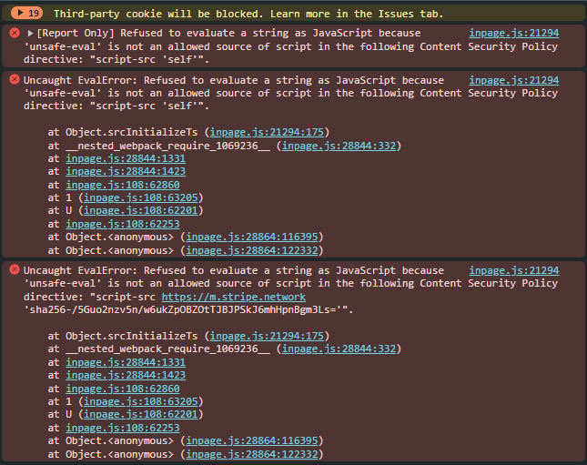

# PT JACKATTACK's - Testing Documentation

Link to deployed site can be found [Here](https://pt-pp-p-5-acaa98cb0828.herokuapp.com/)

---

Testing was ongoing throughout the entire build. We utilised Chrome developer tools whilst building to pinpoint and troubleshoot any issues as we went along.

The page has been inspected using google chrome developer tools & Firefox inspector tool to ensure that the page is fully responsive on a variety of different screen sizes and devices. I have also physically tested the responsiveness of the site on a number of different devices.

---

## CONTENTS

* [AUTOMATED TESTING](#AUTOMATED-TESTING)
  * [W3C Validator](#W3C-Validator)
  * [Python pep8 validation](#python-testing)

* [MANUAL TESTING](#MANUAL-TESTING)
  * [Full Testing](#Full-Testing)

---

## AUTOMATED TESTING

### W3C Validator

[W3C](https://validator.w3.org/) was used to validate the HTML on all pages of the website. It was also used to validate the CSS.

* [Index Page W3C HTML Validation](https://validator.w3.org/nu/#textarea) - Pass

* [style.css CSS Validation](https://jigsaw.w3.org/css-validator/validator) - Pass

* [script.js JS Validation](https://jshint.com/) - Pass

## Python Testing

Python pep8 validation was done via [Code Institute's Python Linter](https://pep8ci.herokuapp.com/)

The only errors recieved here were where some lines of text exceeded the limit of characters a couple of times.

Python Files Tested:

- models
- forms
- views
- urls

___

## Javascript Error

I've been getting this javascript error after I implemented Stripe.

## ADMIN

| TEST | Expected Outcome | PASS/FAIL|
| --- | --- | --- |
| Create a review | Review successfully created and displayed | Pass |
| Edit a review | The review editing was successfull and displayed | Pass |
| Delete a review | The review was deleted and successfull removed | Pass |
| Add a product | product successfully created and displayed | Pass |
| Edit a product | The product editing was successfull and displayed | Pass |
| Delete a product | The product was deleted and successfull removed | Pass |
| Read a message | When clicked on directs to message to read | Pass |
| Delete a message | The message was deleted and successfull removed | Pass |

--- 

## User

| TEST | Expected Outcome | PASS/FAIL|
| --- | --- | --- |
| Create Account | Created successfully | Pass |
| Login | Login Successful | Pass |
| Logout | Logout Successful | Pass |
| Subscribe | Subscribe to a product | Pass |
| Cancel Subscription | Cancel a Subscription | Pass |
| Search | Entering a search returns expected result | Pass |
| Search no results | Entering a no results search returns error message | Fail |
| Navigation Links | Directs user to relevant pages | Pass |
| Sign up for our newsletter | When filled in all details and pressed subscribe the use is subscribed | Pass |
| facebook icon	 | Directs user to facebook page | Pass |
| Contact form submission | successfully sends submit form and can seen by a admin | Pass |
| Review details | Users can read the review details | Pass |

---

Back to [README.md](README.md)